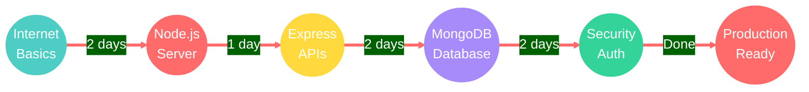

<div align="center">


<br>

### *Where Learning Becomes an Experience*

<br>

[](https://backend-catalyst.netlify.app/)

<br>

<p>
  <a href="https://backend-catalyst.netlify.app/">
    
  </a>
  
  
</p>

<br>


<br><br>

## The Revolution in Learning

```
    99% of sites forces their design on you
    
    Here it's built something different
    
    Your learning. Your way. Your style.
```

<br>

### Instant Compare

<table>
<tr>
<td align="center" width="50%">

**Traditional Sites**


</td>
<td align="center" width="50%">

**Backend Catalyst**


</td>
</tr>
</table>

<br>


<br>

## Theme Studio

**Pick a vibe. Any vibe. Your eyes, your rules.**

<br>

<table>
<tr>
<td align="center">

<br><sub>Dark & Focused</sub>
</td>
<td align="center">

<br><sub>Warm & Cozy</sub>
</td>
<td align="center">

<br><sub>Clean & Calm</sub>
</td>
<td align="center">

<br><sub>Fresh & Natural</sub>
</td>
</tr>
<tr>
<td align="center">

<br><sub>Bold & Energetic</sub>
</td>
<td align="center">

<br><sub>Creative & Modern</sub>
</td>
<td align="center">

<br><sub>Deep & Serene</sub>
</td>
<td align="center">

<br><sub>Intense & Powerful</sub>
</td>
</tr>
</table>

<br>

**6 Handpicked Fonts**

`Fira Code` | `Inter` | `JetBrains Mono` | `Source Sans` | `Roboto` | `Space Grotesk`

*From developer-favorite monospace to buttery smooth sans-serif*

<br>


<br>

## Learn What Matters



<br>


<br><br>


<br>

## Power Features

<table>
<tr>
<td align="center" width="25%">


**Smart Bookmarks**

Drag. Drop. Never lose your place.


</td>
<td align="center" width="25%">


**60fps Smooth**

Every scroll. Every click. Butter smooth.


</td>
<td align="center" width="25%">


**Zero Build**

Open. Learn. No setup needed.


</td>
<td align="center" width="25%">


**Video Tutorials**

Watch. Learn. Master the concepts.


</td>
</tr>
</table>

<br>


<br>

## Start Now

<a href="https://backend-catalyst.netlify.app/">
  
</a>

<br><br>

<table>
<tr>
<td>

<pre>
╔══════════════════════════════════════════════════════════════════╗
║                                                                  ║
║   ┌──────────────────────────────────────────────────────────┐   ║
║   │  TERMINAL                                          ● ● ● │   ║
║   ├──────────────────────────────────────────────────────────┤   ║
║   │                                                          │   ║
║   │  $ git clone https://github.com/user/backend-catalyst    │   ║
║   │                                                          │   ║
║   │  $ cd backend-catalyst                                   │   ║
║   │                                                          │   ║
║   │  $ open index.html                                       │   ║
║   │                                                          │   ║
║   │  Ready to learn!                                         │   ║
║   │                                                          │   ║
║   └──────────────────────────────────────────────────────────┘   ║
║                                                                  ║
╚══════════════════════════════════════════════════════════════════╝
</pre>

</td>
</tr>
</table>

<br>


<br><br>


<br>

## By Developers, For Developers


<br>

### **Shreyansh Dangar**

*Building experiences that make learning addictive*

<br>

<a href="https://github.com/yourusername">
  
</a>

<br><br>


<br><br>


<a href="https://backend-catalyst.netlify.app/">
  
</a>

<br><br>

[](https://backend-catalyst.netlify.app/)

<br><br>

<p align="center">
  
</p>

<p align="center">
  
</p>

<br><br>

</div>
